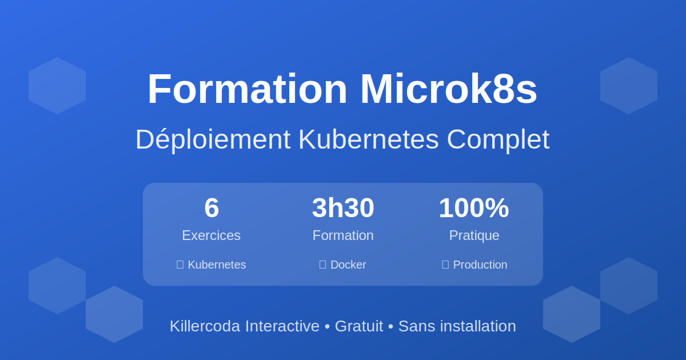
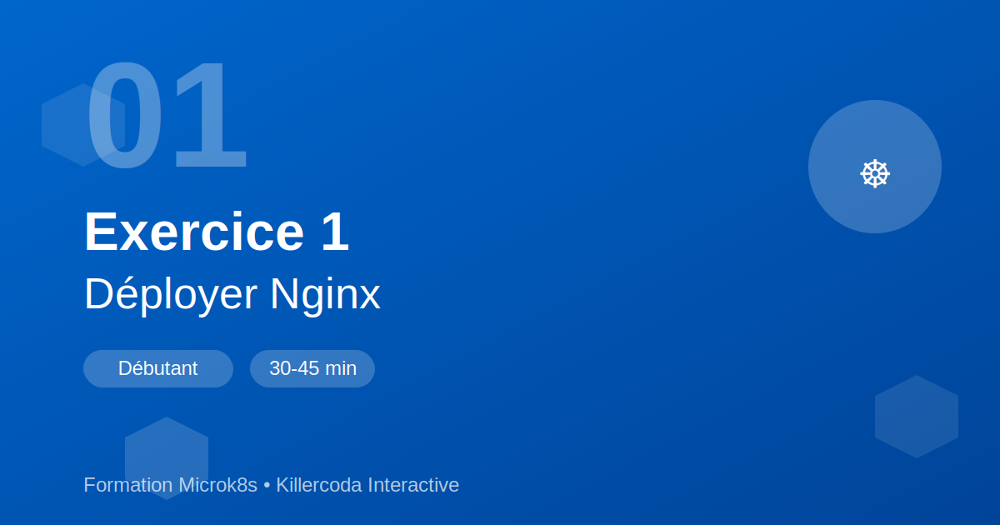
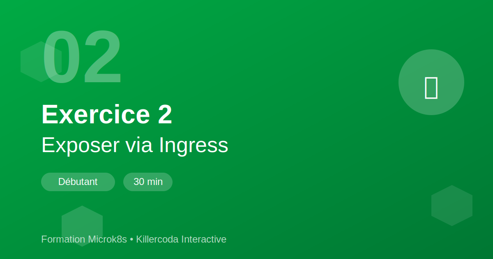
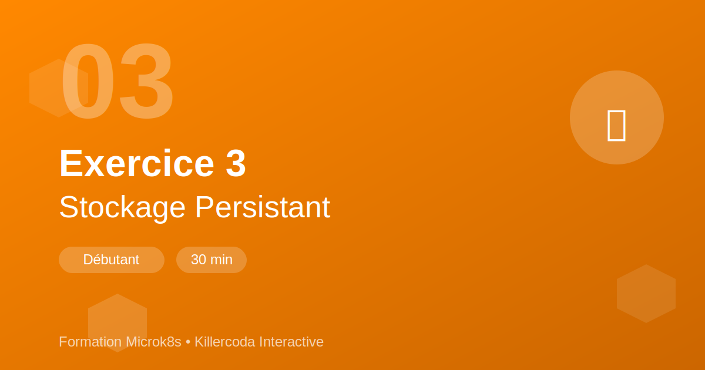
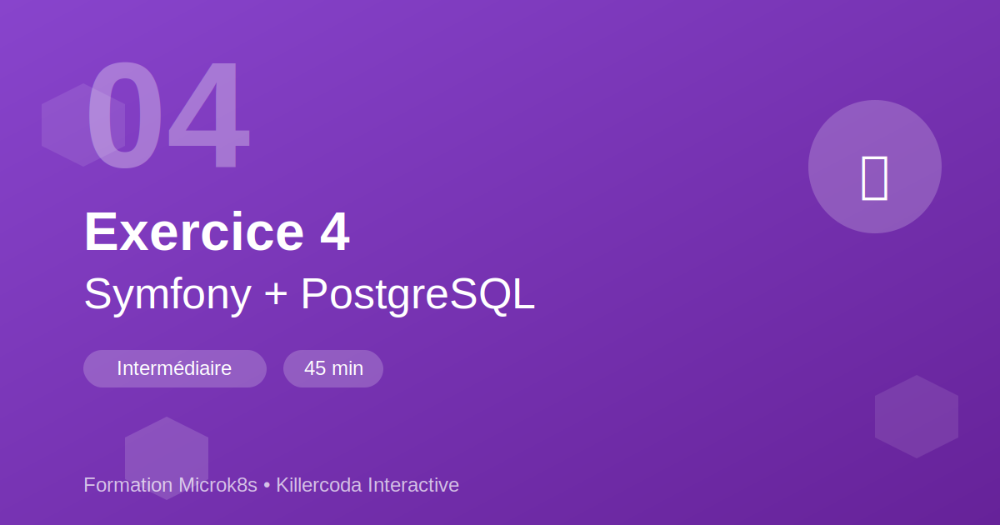
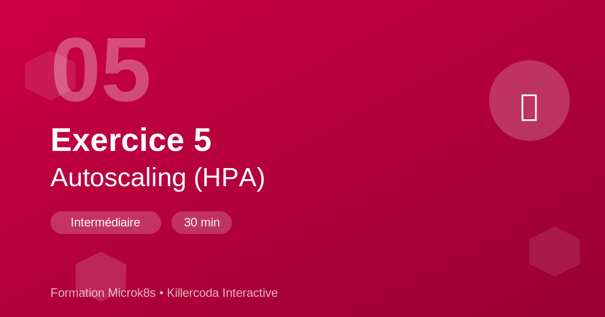
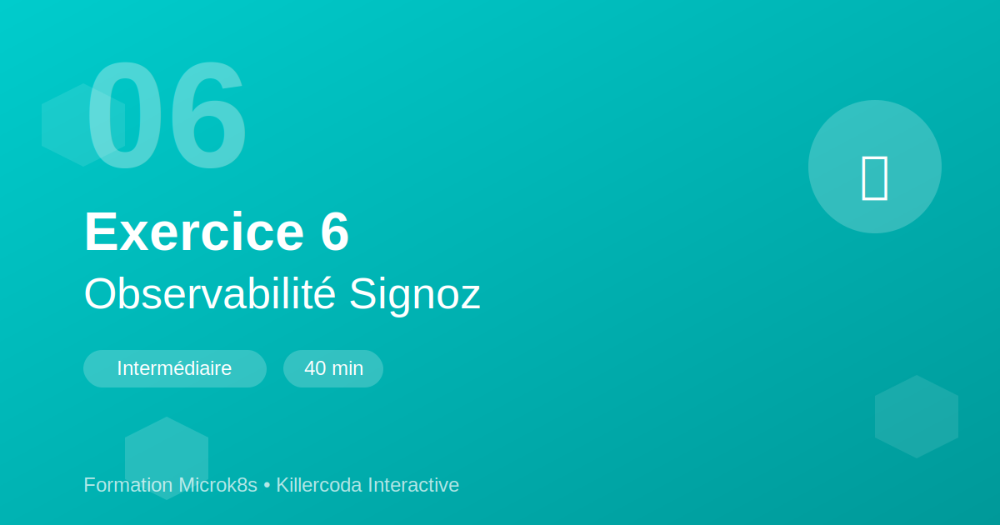

# 🎨 Galerie des Miniatures

Aperçu visuel de toutes les miniatures créées pour les scénarios Killercoda.

---

## 🏆 Formation Complète



**Utilisation** : Page d'accueil, réseaux sociaux, README principal

---

## 📘 Niveau Débutant

### Exercice 1 : Déployer Nginx



- **Durée** : 30-45 minutes
- **Couleur** : Bleu (#0066CC)
- **Concepts** : Deployment, Service, Scaling, Rolling Update

---

### Exercice 2 : Exposer via Ingress



- **Durée** : 30 minutes
- **Couleur** : Vert (#00AA44)
- **Concepts** : Ingress Controller, Path-based routing, Host-based routing

---

### Exercice 3 : Stockage Persistant



- **Durée** : 30 minutes
- **Couleur** : Orange (#FF8800)
- **Concepts** : PV, PVC, StorageClass, Persistance

---

## 📗 Niveau Intermédiaire

### Exercice 4 : Symfony + PostgreSQL



- **Durée** : 45 minutes
- **Couleur** : Violet (#8844CC)
- **Concepts** : StatefulSet, Jobs, ConfigMaps, Applications complexes

---

### Exercice 5 : Autoscaling (HPA)



- **Durée** : 30 minutes
- **Couleur** : Rouge (#CC0044)
- **Concepts** : HPA, Metrics Server, Autoscaling automatique

---

### Exercice 6 : Observabilité Signoz



- **Durée** : 40 minutes
- **Couleur** : Cyan (#00CCCC)
- **Concepts** : OpenTelemetry, Tracing distribué, Métriques, Logs

---

## 📊 Spécifications Techniques

| Propriété | Valeur |
|-----------|--------|
| **Format** | SVG (vectoriel) |
| **Dimensions** | 1200 x 630 px |
| **Ratio** | 1.9:1 (Open Graph) |
| **Taille fichier** | ~2-3 KB (SVG) |
| **Palette** | 6 couleurs uniques |
| **Style** | Dégradés modernes |

---

## 🎯 Éléments de Design

Chaque miniature contient :

- ✅ **Numéro de l'exercice** (grand, semi-transparent)
- ✅ **Titre** (gras, ligne 1)
- ✅ **Sous-titre** (descriptif, ligne 2)
- ✅ **Badge niveau** (Débutant/Intermédiaire)
- ✅ **Badge durée** (temps estimé)
- ✅ **Icône représentative** (emoji ou symbole)
- ✅ **Hexagones décoratifs** (style Kubernetes)
- ✅ **Footer** (branding Formation Microk8s)

---

## 🌈 Palette de Couleurs

```
🔵 Bleu     #0066CC → #004499  (Exercice 1)
🟢 Vert     #00AA44 → #007733  (Exercice 2)
🟠 Orange   #FF8800 → #CC6600  (Exercice 3)
🟣 Violet   #8844CC → #662299  (Exercice 4)
🔴 Rouge    #CC0044 → #990033  (Exercice 5)
🔵 Cyan     #00CCCC → #009999  (Exercice 6)
```

---

## 📱 Utilisation

### Sur Killercoda
1. Convertir en PNG : `./convert-to-png.sh`
2. Uploader dans Settings → Thumbnail
3. Ou ajouter dans `index.json` : `"image": "XX-nom.png"`

### Sur GitHub
```markdown

```

### Sur Twitter
```html
<meta name="twitter:image" content="https://url/01-deployer-nginx.png">
```

### Sur LinkedIn/Facebook
```html
<meta property="og:image" content="https://url/01-deployer-nginx.png">
```

---

## 🛠️ Modification

Pour personnaliser :

1. **Ouvrir le SVG** dans un éditeur (Inkscape, Figma, VS Code)
2. **Modifier les textes** (balises `<text>`)
3. **Changer les couleurs** (dans les gradients `<linearGradient>`)
4. **Ajuster les icônes** (emojis dans les balises `<text>`)
5. **Sauvegarder** et reconvertir en PNG

---

## ✨ Variantes Possibles

Vous pourriez créer :

- **Versions dark mode** (fond sombre)
- **Versions carrées** (1200x1200 pour Instagram)
- **Versions verticales** (stories Instagram/Facebook)
- **GIFs animés** (avec transitions)
- **Versions localisées** (EN, ES, DE, etc.)

---

## 📏 Dimensions Recommandées

| Plateforme | Dimensions | Ratio |
|------------|------------|-------|
| **Killercoda** | 1200x630 | 1.9:1 |
| **Twitter Card** | 1200x628 | 1.91:1 |
| **Facebook** | 1200x630 | 1.9:1 |
| **LinkedIn** | 1200x627 | 1.91:1 |
| **Instagram Post** | 1080x1080 | 1:1 |
| **Instagram Story** | 1080x1920 | 9:16 |

---

## 💡 Conseils de Design

1. **Contraste** : Assurer une bonne lisibilité (texte blanc sur fond coloré)
2. **Hiérarchie** : Taille de police décroissante (numéro > titre > sous-titre)
3. **Cohérence** : Garder le même style sur tous les exercices
4. **Simplicité** : Éviter de surcharger l'image
5. **Identité** : Toujours inclure le branding "Formation Microk8s"

---

**🎨 Créé avec ❤️ pour la Formation Microk8s**

*Fichiers source SVG modifiables • Open source • Réutilisables*
